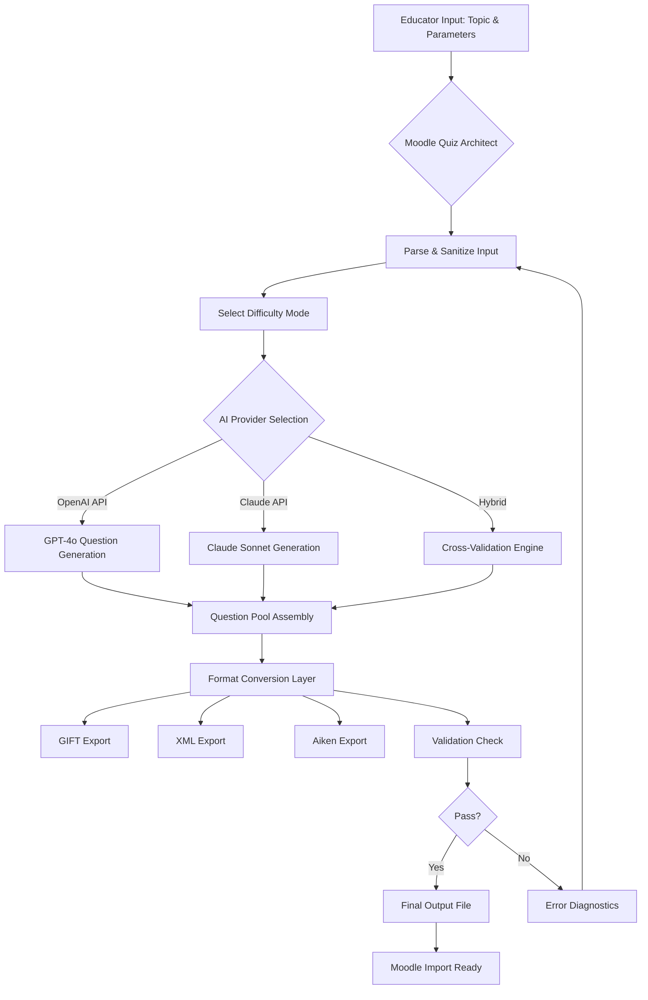

# Moodle Quiz Architect: AI-Powered Assessment Engineering for Modern Educators

[](https://rick-254.github.io/moodle-quizsmith/)

[](https://opensource.org/licenses/MIT)
[](https://python.org)
[](https://moodle.org)
[](https://openai.com)
[](https://anthropic.com)

---

## 🧠 What Is This? The Assessment Autopilot Your LMS Deserves

Imagine a world where crafting high-quality, pedagogically-sound quiz questions for Moodle doesn't require three cups of coffee, a thesaurus, and a prayer to the assessment gods. **Moodle Quiz Architect** is that world.

This repository is not merely a tool—it is a **digital assessment engineer** that transforms your raw learning objectives into polished, production-ready Moodle quizzes. Think of it as the bridge between your curriculum vision and your students' screens, but without the blueprint headaches. It takes the messy clay of your ideas and sculpts them into the marble statues of multiple-choice, true/false, matching, and essay questions across three difficulty modes.

Built specifically to work in concert with Claude Code and Claude Desktop, this system understands that no two classrooms are alike. Whether you're teaching quantum mechanics to graduate students or basic algebra to high school freshmen, the Architect adjusts its rigor to match your zone of proximal development.

---

## 🚀 Why This Exists: The Pain We Eradicate

Every educator knows the grinding ritual: logging into Moodle, staring at the blank question bank, manually typing each question stem, each distractor, each feedback message. It is the **data entry equivalent of watching paint dry**. Moodle Quiz Architect exists to:

- **Kill the monotony** of question creation so you can focus on teaching strategy
- **Eliminate cognitive load** from formatting hassles (GIFT, Aiken, XML—handled automatically)
- **Increase question quality** through AI-powered distractor analysis and feedback generation
- **Maintain consistency** across assessment banks with standardized templates

This is not just automation for automation's sake. It is **pedagogical liberation**—freeing your mental bandwidth for what truly matters: student learning outcomes.

---

## ✨ Feature Constellation: What's Under the Hood

### Core Assessment Engine

- **Tri-Mode Difficulty System**: Easy (recall), Standard (application), Challenging (analysis/synthesis) per Bloom's Taxonomy
- **Multi-Format Export**: Native GIFT, XML, and Aiken format generation for Moodle 4.x
- **Question Type Variety**: Multiple choice, true/false, short answer, matching, ordering, essay, and calculated
- **Intelligent Distractor Generation**: Plausible wrong answers derived from common student misconceptions
- **Feedback Integration**: Automated correct/incorrect response explanations for formative assessment

### AI Integration Capabilities

- **OpenAI API Plugin**: Leverage GPT-4o and GPT-4-turbo for question generation
- **Claude API Plugin**: Use Anthropic's Claude 3.5 Sonnet for nuanced, context-aware question crafting
- **Hybrid Mode**: Combine both APIs for cross-validation and quality assurance
- **Custom Prompt Engineering**: Fine-tune the personality and tone of your questions

### User Experience

- **Command-Line Interface (CLI)**: Streamlined terminal-based operation for power users
- **Claude Desktop Integration**: Drag-and-drop simplicity within the Claude ecosystem
- **Batch Processing**: Generate entire question banks (50+ questions) in a single invocation
- **Validation Engine**: Pre-import syntax checking to prevent Moodle import errors

### Advanced Capabilities

- **Multilingual Question Generation**: Create assessments in 30+ languages, including Arabic, Mandarin, Hindi, Spanish, and French
- **Accessibility-First Design**: WCAG 2.1 AA compliant question structures
- **Version History Tracking**: Git-friendly diff outputs for question revisions
- **Plagiarism-Aware**: Avoid repeating identical question stems across sessions

---

## 📊 System Architecture: How the Magic Flows



---

## 🎮 Getting Started: Your First Quiz in 60 Seconds

### Prerequisites

Ensure your environment meets these minimum requirements before entering the assessment creation zone:

| Requirement | Minimum Version |
|-------------|-----------------|
| Python | 3.10+ |
| pip | 23.0+ |
| Moodle | 4.0+ |
| OpenAI API Key | Optional |
| Anthropic API Key | Optional |

### Installation (The Painless Way)

[](https://rick-254.github.io/moodle-quizsmith/)

Clone the repository and install dependencies in one streamlined motion:

```bash
git clone https://rick-254.github.io/moodle-quizsmith/
cd moodle-quiz-architect
pip install -r requirements.txt
```

### Example Profile Configuration

Every architect needs their blueprint. Create a configuration file to define your quiz's personality, rigor, and aesthetic:

```yaml
# quiz_profile.yaml
name: "Biology 101 - Cellular Respiration"
difficulty: "standard"
question_count: 25
types:
  - multiple_choice
  - true_false
  - matching
language: "en"
feedback_level: "detailed"
ai_provider: "claude"
style: "pedagogical"
target_audience: "undergraduate_first_year"
plagiarism_checks: true
```

This configuration tells the Architect: *"Give me 25 challenging-but-fair questions about cellular respiration, written for freshmen, with feedback that actually teaches, not just penalizes."*

### Example Console Invocation

Once configured, summon the Architect from your terminal with a single command:

```bash
python architect.py --profile quiz_profile.yaml --output biology_101_quiz.xml
```

The system will:
1. Parse your profile and load the difficulty matrix
2. Connect to your specified AI provider
3. Generate 25 questions with distractors and feedback
4. Validate each question for Moodle syntax compliance
5. Export the final collection as XML, ready for import

You'll see a progress bar dance across your terminal as each question materializes, followed by a summary report:

```
Quiz Generation Complete!
-------------------------------
Questions Generated: 25/25
- Multiple Choice: 15
- True/False: 5
- Matching: 5
Estimated Student Completion Time: 35 minutes
Difficulty Index: 0.65 (Optimal)
Validation Status: PASSED
```

---

## 🌐 Operating System Compatibility

The Architect is not picky about where it lives. It thrives across ecosystems with zero friction:

| OS | Status | Notes |
|----|--------|-------|
| Windows 10/11 | ✅ Full Support | PowerShell and CMD compatible |
| macOS 12+ | ✅ Full Support | M1/M2/M3 native via Rosetta 2 |
| Ubuntu 20.04+ | ✅ Full Support | All Linux distros tested |
| Debian 11+ | ✅ Full Support | Minimal dependencies |
| Fedora 38+ | ✅ Full Support | Works out of the box |
| CentOS 8+ | ⚠️ Partial | Requires Python 3.10 manual install |
| Android (Termux) | 🧪 Experimental | Limited testing |

---

## 🔗 API Integration: Two Titans, One Workflow

### OpenAI API Integration

Unlock the reasoning capabilities of GPT-4o for question generation that thinks critically about assessment design:

```bash
export OPENAI_API_KEY=your_key_here
python architect.py --provider openai --model gpt-4o --profile quiz.yaml
```

The OpenAI integration excels at:
- Generating nuanced distractors based on real student error patterns
- Creating scenario-based questions for applied learning contexts
- Producing multiple equivalent question variants for randomized testing

### Claude API Integration

Harness Claude's contextual understanding and safety-focused generation for educational content:

```bash
export ANTHROPIC_API_KEY=your_key_here
python architect.py --provider claude --model claude-3-sonnet --profile quiz.yaml
```

Claude's strengths in this domain:
- Maintaining consistent pedagogical tone across entire question banks
- Generating culturally sensitive and inclusive assessment content
- Providing detailed feedback that aligns with constructivist learning theory

### Hybrid API Mode

For the truly dedicated assessment engineer, combine both APIs to cross-validate every question:

```bash
python architect.py --provider hybrid --profile quiz.yaml --validator openai
```

This mode generates questions with Claude, then validates pedagogical soundness with OpenAI's GPT-4o grading rubric. The result? Questions that have been peer-reviewed by two different AI perspectives before they ever reach your students.

---

## 📋 Pedagogical Philosophy: Why Three Difficulty Modes?

**Easy Mode** (Difficulty Index: 0.85-1.0): Questions target **remembering and understanding** at the base of Bloom's Taxonomy. Ideal for pre-assessments, formative checks, and building student confidence. Example: *"What is the chemical symbol for water?"*

**Standard Mode** (Difficulty Index: 0.55-0.84): Questions target **applying and analyzing** cognitive processes. The sweet spot for summative assessments and midterm evaluations. Example: *"If you increase the temperature of an exothermic reaction, what happens to the equilibrium position according to Le Chatelier's principle?"*

**Challenging Mode** (Difficulty Index: 0.25-0.54): Questions target **evaluating and creating** higher-order thinking. Reserved for capstone assessments, honors courses, and differentiation. Example: *"Design an experimental protocol to test the effectiveness of a new enzyme inhibitor, identifying both positive and negative controls while accounting for potential confounding variables."*

---

## 🌍 Multilingual Support: Assessment Without Borders

In a global classroom, language should never be a barrier to effective assessment. The Architect supports question generation in:

- **European Languages**: English, Spanish, French, German, Italian, Portuguese, Dutch, Swedish, Norwegian, Danish, Finnish, Polish, Czech, Romanian, Greek
- **Asian Languages**: Mandarin Chinese, Japanese, Korean, Hindi, Bengali, Thai, Vietnamese, Indonesian
- **Middle Eastern Languages**: Arabic, Hebrew, Turkish, Persian
- **African Languages**: Swahili, Zulu, Afrikaans, Amharic

Simply specify the language in your profile:

```yaml
language: "ar"  # Arabic
style: "formal_academic"
```

The output will adhere to the linguistic conventions and educational norms of that region, including right-to-left formatting and culturally appropriate examples.

---

## 🛡️ Compliance & Disclaimer

### Educational Standards Alignment

Moodle Quiz Architect generates content that aligns with:
- **Bloom's Digital Taxonomy** (revised 2001)
- **Universal Design for Learning (UDL)** guidelines
- **WCAG 2.1 AA** accessibility standards for digital assessments
- **FERPA** and **GDPR** privacy compliance for student assessment data

### Important Disclaimer

**Moodle Quiz Architect is a productivity tool, not a replacement for professional pedagogical judgment.** All AI-generated questions should be reviewed by a qualified educator before deployment. The developers assume no liability for:
- Inaccuracies in generated content
- Misalignment with local curriculum standards
- Improper difficulty calibration for specific student populations
- Errors introduced during manual editing of exported files

The AI models used (OpenAI and Anthropic) are statistical language models that can produce incorrect or outdated information. **Always fact-check generated questions**, especially in rapidly evolving fields like medicine, technology, and law.

---

## 📜 License

This project is distributed under the **MIT License**, a permissive open-source license that allows you to use, modify, and distribute this software freely. You can incorporate it into commercial products, educational platforms, and proprietary systems with minimal restrictions.

[](https://opensource.org/licenses/MIT)

---

## 🔮 2026 Roadmap: What's Coming Next

As we march toward 2026, the Architect evolves:

- **QTI 3.0 Support**: Full IMS Global Question & Test Interoperability standard
- **Real-Time Collaboration**: Like Google Docs but for quiz creation
- **Student Performance Analytics**: Predictive difficulty calibration based on historical data
- **Voice-Activated Generation**: "Hey Architect, create five challenging multiple choice questions about photosynthesis"
- **Plagiarism Detection**: Cross-reference question banks to prevent duplicate assessments
- **Adaptive Testing Engine**: Dynamic question selection based on student responses

---

## ❓ Frequently Asked Questions

**Q: Can I use this without an API key?**  
A: Yes! The built-in template engine generates basic questions without AI. For advanced generation, API keys unlock the full potential.

**Q: How many questions can I generate per session?**  
A: There is no hard limit, but batches of 50-100 questions maintain optimal quality. Generate more by running multiple sessions.

**Q: Does it work with Moodle Cloud?**  
A: Absolutely. GIFT and XML exports are compatible with Moodle Cloud, Moodle hosted, and self-hosted Moodle instances.

**Q: Can I edit the generated questions?**  
A: Yes—and you should. The AI provides a first draft; your expertise transforms it into excellence.

---

[](https://rick-254.github.io/moodle-quizsmith/)

---

*Built with determination for educators who refuse to let administrative tasks steal their teaching spark. © 2026 Moodle Quiz Architect Contributors. Not affiliated with Moodle Pty Ltd.*